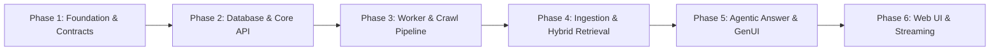

# Company AI — E2E Technical Architecture & Reference Guide

## 1. Architecture Overview

Use a **TypeScript monorepo + modular monolith + asynchronous background workers**.

```text
                         ┌──────────────────────┐
                         │       Next.js        │
                         │  Chat / Voice / UI   │
                         └──────────┬───────────┘
                                    │
                                HTTP + SSE
                                    │
                                    ▼
                         ┌──────────────────────┐
                         │    Bun + Elysia      │
                         │   Modular Monolith   │
                         └──────────┬───────────┘
                                    │
             ┌──────────────────────┼──────────────────────┐
             │                      │                      │
             ▼                      ▼                      ▼
        Companies              Retrieval              Conversation
        / Ingestion            / Knowledge              / Voice
             │                      │                      │
             └──────────────────────┼──────────────────────┘
                                    │
                                  Redis
                                BullMQ Queue
                                    │
                         ┌──────────┴──────────┐
                         ▼                     ▼
                  Crawl Worker          Processing Worker
                         │                     │
                         ▼                     ▼
                   Playwright /          Extraction & Clean
                   Cheerio               Classification
                   URL discovery         Chunking
                   HTML fetching         Fact Extraction
                                         Vector Embeddings
                         │                     │
                         └──────────┬──────────┘
                                    ▼
                    ┌─────────────────────────────┐
                    │       Knowledge Layer       │
                    │ PostgreSQL + pgvector + S3  │
                    └──────────────┬──────────────┘
                                   │
                           Company Snapshot
                                   │
                                   ▼
                            Hybrid Retrieval
                        (SQL + Vector + Keyword)
                                   │
                                   ▼
                               LLM Answer
                                   │
                    ┌──────────────┼──────────────┐
                    ▼              ▼              ▼
                  Text            TTS          VisualSpec
                                                   │
                                                   ▼
                                             Brand System
                                                   │
                                                   ▼
                                                 GenUI
```

---

## 2. Core Stack Decisions & Justifications

| Layer | Technology | Selection Rationale |
| :--- | :--- | :--- |
| **Monorepo & Package Manager** | **Bun Workspaces + Turborepo** | Native Bun workspaces (`"workspaces"` in `package.json`) + Turborepo task runner & caching. Zero pnpm overhead. |
| **Frontend** | **Next.js (App Router) + React + TS** | Modern server/client component model, SSR, fast client transitions running directly on Bun. |
| **Styling** | **Tailwind CSS + CSS Variables** | Dynamic CSS variable injection for brand tokens (colors, radii, fonts). |
| **UI Components** | **shadcn/ui + Lucide Icons** | Accessible, headless primitives styled with Tailwind; no black-box UI locks. |
| **Backend API** | **Bun.js + Elysia** | Blazing-fast HTTP/SSE throughput, low memory footprint, native TypeScript. |
| **Worker Runtime** | **Bun + BullMQ** | High-performance async queue worker running unified on the Bun runtime. |
| **Database & ORM** | **PostgreSQL + Drizzle ORM** | Native `pgvector` type support, zero query-engine binaries, typed SQL joins, instant cold starts on Bun. |
| **Vector Engine** | **pgvector (Postgres extension)** | Eliminates dual-database drift (Postgres $\leftrightarrow$ Pinecone/Qdrant); unified ACID transactions. |
| **Queue / Cache** | **Redis + BullMQ** | Resilient background job management, concurrency throttling, job retry/backoff. |
| **Ingestion Engine** | **Playwright + Cheerio + Readability** | Tiered crawler: ultra-fast static fetch (Cheerio) + headless fallback (Playwright). |
| **Object Storage** | **S3-compatible (MinIO / Cloudflare R2 / AWS S3)** | Immutable storage for logos, assets, raw HTML archives, audio files. |
| **Realtime / Streaming**| **Server-Sent Events (SSE)** | Unidirectional, HTTP/2 multiplexed, robust streaming for text, audio, and UI specs. |
| **Validation** | **Zod** | Shared contract validation across API input, worker jobs, LLM function outputs, and GenUI specs. |
| **AI Adapters** | **Provider-agnostic interface** | Decoupled LLM, STT, and TTS implementations (OpenAI, Anthropic, Gemini, ElevenLabs). |

> **Architectural Guardrail**: Do **not** introduce microservices, Kafka, Kubernetes, or standalone vector databases at this stage. A clean modular monolith with async workers scales to millions of requests with minimal operational friction.

---

## 3. Monorepo Structure (Bun Workspaces + Turborepo)

```text
company-ai/
│
├── apps/
│   ├── web/                         # Next.js frontend (Chat, UI, GenUI) running on Bun
│   └── api/                         # Elysia API server (Routes, Orchestration) on Bun
│
├── workers/
│   └── worker/                      # BullMQ background workers (Crawl, Ingestion, Embeddings)
│
├── packages/
│   ├── contracts/                   # Shared Zod schemas, API types, GenUI specs
│   ├── database/                    # Drizzle ORM schema, migrations, DB client, pgvector
│   ├── crawler/                     # Cheerio/Playwright crawl logic, robots/sitemap parsing
│   ├── knowledge/                   # Chunking, fact extraction, document normalization
│   ├── retrieval/                   # Hybrid retrieval engine (SQL + pgvector + FTS) + Reranker
│   ├── ai/                          # Provider-agnostic LLM/STT/TTS adapters
│   ├── genui/                       # GenUI spec definitions, component schema contracts
│   ├── brand/                       # Brand token extraction, color normalization, style mapper
│   ├── queues/                      # BullMQ queue definitions, job types, Redis client
│   └── shared/                      # Global constants, logger, error types, helpers
│
├── package.json                     # Root package with native Bun "workspaces" field
├── turbo.json                       # Turborepo task pipeline definition
├── tsconfig.json                    # Shared base TypeScript config
└── .env.example
```

### Root Configuration Pattern

#### Root `package.json`
```json
{
  "name": "company-ai",
  "private": true,
  "workspaces": [
    "apps/*",
    "packages/*",
    "workers/*"
  ],
  "scripts": {
    "dev": "turbo run dev",
    "build": "turbo run build",
    "lint": "turbo run lint",
    "clean": "turbo run clean"
  },
  "devDependencies": {
    "turbo": "^2.4.0",
    "typescript": "^5.7.0"
  }
}
```

#### Turborepo `turbo.json`
```json
{
  "$schema": "https://turbo.build/schema.json",
  "tasks": {
    "build": {
      "dependsOn": ["^build"],
      "outputs": [".next/**", "!.next/cache/**", "dist/**"]
    },
    "dev": {
      "cache": false,
      "persistent": true
    },
    "lint": {}
  }
}
```

### Common Developer CLI Workflows with Bun + Turbo

| Action | Command | What It Does |
| :--- | :--- | :--- |
| **Run all dev servers** | `bun dev` *(or `bun x turbo dev`)* | Concurrently runs Next.js (port 3000), Elysia (port 3001), and Worker with color-coded logs. |
| **Install all dependencies** | `bun install` | Resolves and links all workspace dependencies in sub-seconds. |
| **Add external dep to an app** | `bun --filter api add elysia` | Adds dependency specifically to `apps/api`. |
| **Link internal package** | `bun --filter web add @company-ai/contracts` | Links internal workspace package using Bun workspaces. |
| **Run single app dev** | `bun x turbo --filter web dev` | Starts only the Next.js frontend. |
| **Build all packages** | `bun run build` | Builds packages in topological order with Turbo intelligent caching. |

### Process Topologies
Deploy and run three distinct process targets:
1. `apps/web` (Next.js server via Bun)
2. `apps/api` (Elysia API orchestrator via Bun)
3. `workers/worker` (BullMQ async processor via Bun)

The packages under `packages/*` are **logical boundaries**, shared directly across apps and workers without separate network hops.

---

## 4. Frontend Architecture (`apps/web`)

```text
apps/web/
│
├── app/
│   ├── layout.tsx
│   ├── page.tsx                     # Landing & URL input
│   ├── company/
│   │   └── [companyId]/             # Company dashboard & snapshot overview
│   └── chat/
│       └── [conversationId]/        # Multimodal chat & voice interaction interface
│
├── components/
│   ├── layout/                      # Navbar, Sidebar, AppShell
│   ├── company/                     # Ingestion progress, status badges, snapshot history
│   ├── chat/                        # Message list, streaming bubble, citation viewer
│   ├── voice/                       # Audio visualizer, voice input controls, TTS player
│   ├── sources/                     # Verified source drawer, evidence references
│   └── generative/                  # GenUI Verified Component Registry
│       ├── Hero.tsx
│       ├── Stats.tsx
│       ├── Pricing.tsx
│       ├── ProductGrid.tsx
│       ├── Timeline.tsx
│       ├── Comparison.tsx
│       ├── People.tsx
│       ├── Quote.tsx
│       └── registry.tsx             # Type-safe dynamic component resolver
│
├── hooks/
│   ├── use-chat-stream.ts           # SSE stream listener & state builder
│   ├── use-brand-theme.ts           # Applies extracted BrandTokens via CSS variables
│   └── use-audio-player.ts          # Queue-based audio playback for TTS
│
├── lib/
│   ├── api.ts                       # Typed fetch client
│   └── utils.ts
│
└── stores/
    └── conversation.store.ts        # Chat and session client state
```

### Strict Frontend Responsibilities
* **Owns**: UI rendering, local client state, SSE event consumption, queue-based audio playback, brand token CSS injection, verified component mapping.
* **Prohibits**: Executing arbitrary AI-generated JSX, HTML `dangerouslySetInnerHTML`, or unvalidated dynamic scripts.

---

## 5. Generative UI (GenUI) Architecture

The LLM does **not** write raw UI code or HTML. The LLM generates a strictly validated **VisualSpec JSON**.

```text
      LLM Output (JSON)
              │
              ▼
    Zod Validation (packages/contracts)
              │
              ▼
    GenUI Component Registry
              │
              ▼
   Brand System CSS Token Wrap
              │
              ▼
     Rendered React Component
```

### VisualSpec Definition
```ts
export type VisualSpec =
  | {
      type: "stats";
      props: {
        title: string;
        items: { label: string; value: string; change?: string }[];
      };
    }
  | {
      type: "pricing";
      props: {
        plans: {
          name: string;
          price: string;
          period?: string;
          features: string[];
          highlighted?: boolean;
        }[];
      };
    }
  | {
      type: "timeline";
      props: {
        events: { date: string; title: string; description: string }[];
      };
    }
  | {
      type: "comparison";
      props: {
        headers: string[];
        rows: { feature: string; values: (string | boolean)[] }[];
      };
    }
  | {
      type: "products";
      props: {
        products: { name: string; description: string; tag?: string; link?: string }[];
      };
    };
```

### Component Registry Pattern
```tsx
// apps/web/components/generative/registry.tsx
export const componentRegistry: Record<string, React.FC<any>> = {
  hero: Hero,
  stats: Stats,
  pricing: Pricing,
  products: ProductGrid,
  timeline: Timeline,
  comparison: Comparison,
  people: People,
  quote: Quote,
};

export function GenUIRenderer({ spec, brand }: { spec: VisualSpec; brand: BrandTokens }) {
  const Component = componentRegistry[spec.type];
  if (!Component) return null;

  return (
    <div className="genui-container" style={brandToCSSVariables(brand)}>
      <Component {...spec.props} />
    </div>
  );
}
```

* **The AI determines**: *What* information structure to present.
* **The Application determines**: *How* it is safely rendered and visually branded.

---

## 6. Backend API Architecture (`apps/api`)

Use a **domain-oriented modular monolith**.

```text
apps/api/src/
│
├── modules/
│   ├── companies/                   # Company CRUD, snapshot lifecycle
│   ├── crawling/                    # Ingestion triggers, job status dispatch
│   ├── knowledge/                   # Document & fact management
│   ├── retrieval/                   # Query planning & hybrid retrieval service
│   ├── conversations/               # Thread state & message history
│   ├── voice/                       # Audio generation & STT/TTS coordination
│   ├── generative-ui/               # VisualSpec contract validation
│   └── brand/                       # Brand token delivery & updates
│
├── infrastructure/
│   ├── database/                    # Drizzle connection pool & repository helpers
│   ├── queue/                       # BullMQ producer clients
│   ├── storage/                     # S3-compatible client (MinIO / R2)
│   ├── llm/                         # Provider adapters
│   └── telemetry/                   # Logging, tracing, and health checks
│
├── app.ts                           # Elysia app instance & route assembly
└── server.ts                        # Bun HTTP server entrypoint
```

Each module encapsulates its own routes, service layer, repository access, and Zod schemas.

---

## 7. Company Lifecycle & Snapshot Versioning

The core domain entity is the **Company**, versioned immutably via **CompanySnapshot**.

```text
Company
│
├── Brand (Latest tokens, logo, typography)
├── Crawls (Historical crawl runs)
│   ├── Pages Discovered
│   └── Crawl Errors/Events
├── Snapshots (Immutable knowledge versions)
│   ├── Snapshot v1 (Initial ingest)
│   │   ├── Documents
│   │   ├── Facts
│   │   └── Vector Chunks
│   └── Snapshot v2 (Refreshed ingest)
└── Conversations (User threads citing specific snapshots)
```

### Benefits of Immutable Snapshots
1. **Reproducibility**: Answers link back to the exact snapshot and document revision used.
2. **Atomic Ingestion**: New crawls publish a complete, verified snapshot only after all embeddings and facts are indexed (`status: READY`).
3. **Differential Updates**: Compare `Snapshot v2` against `v1` to identify deleted pages, pricing adjustments, or added products.

---

## 8. Tiered Ingestion & Crawler Pipeline

```text
POST /companies  { url: "https://example.com" }
       │
       ▼
1. Normalize URL & Verify Security (Prevent SSRF / Private IPs)
       │
       ▼
2. Create Company & Pending Snapshot record
       │
       ▼
3. Dispatch BullMQ Job { companyId, snapshotId, url }
       │
       ▼
Return HTTP 202 Accepted { companyId, jobId, status: "queued" }
```

### Worker Pipeline Workflow
```text
BullMQ Ingestion Worker
       │
       ▼
[Tier 1 Discovery]
Sitemap.xml, robots.txt, canonical links
       │
       ▼
[Tiered Fetching]
  ├─ Fast Path: Cheerio HTTP Fetch (Static HTML, fast, lightweight)
  └─ Dynamic Fallback: Playwright Headless (When client-side JS / hydration detected)
       │
       ▼
[Content Extraction & Cleaning]
Mozilla Readability + Cheerio stripping (nav, footers, cookie banners, scripts)
       │
       ▼
[Brand Intelligence Extraction]
Favicon, logos, primary/secondary colors, CSS font rules, meta themes
       │
       ▼
[Document Processing]
  ├─ Structured Fact Extraction (LLM identifies key value pairs: pricing, founders, address)
  └─ Semantic Chunking (500–1000 tokens with overlap)
       │
       ▼
[Embedding Generation & Indexing]
Compute vector embeddings (e.g., text-embedding-3-small)
       │
       ▼
[Transactional Commit]
Save Pages, Documents, Chunks, Embeddings, Facts, and Brand to PostgreSQL
       │
       ▼
Publish Snapshot Status: "READY"
```

### Crawler Safeguards
* **SSRF Protection**: Reject private IP ranges (`127.0.0.1`, `10.0.0.0/8`, `192.168.0.0/16`, AWS metadata `169.254.169.254`).
* **Hard Limits**: `maxPages` (default 50), `maxDepth` (default 3), `maxPageSizeBytes` (5MB), `crawlTimeoutMs` (5 mins).
* **Concurrency**: Restrict Playwright browser pools to 2–4 concurrent instances per worker to protect memory.

---

## 9. Knowledge Layer & Database Models (Drizzle ORM)

PostgreSQL with the `pgvector` extension serves as the single source of truth.

```text
PostgreSQL
├── companies
├── company_snapshots
├── pages
├── documents
├── chunks (contains embedding: vector(1536))
├── facts
├── brands
├── conversations
└── messages

S3-Compatible Object Store
├── /logos/
├── /og-images/
├── /audio/
└── /raw-html/
```

### Core Schema Definition (`packages/database`)
```ts
import { pgTable, uuid, text, timestamp, jsonb, vector, integer, boolean } from "drizzle-orm/pg-core";

export const companies = pgTable("companies", {
  id: uuid("id").defaultRandom().primaryKey(),
  domain: text("domain").notNull().unique(),
  name: text("name").notNull(),
  url: text("url").notNull(),
  createdAt: timestamp("created_at").defaultNow().notNull(),
});

export const companySnapshots = pgTable("company_snapshots", {
  id: uuid("id").defaultRandom().primaryKey(),
  companyId: uuid("company_id").references(() => companies.id).notNull(),
  version: integer("version").notNull(),
  status: text("status").notNull(), // 'QUEUED' | 'CRAWLING' | 'PROCESSING' | 'READY' | 'FAILED'
  pageCount: integer("page_count").default(0),
  createdAt: timestamp("created_at").defaultNow().notNull(),
});

export const brands = pgTable("brands", {
  id: uuid("id").defaultRandom().primaryKey(),
  companyId: uuid("company_id").references(() => companies.id).notNull(),
  logoUrl: text("logo_url"),
  tokens: jsonb("tokens").notNull(), // BrandTokens structure
  createdAt: timestamp("created_at").defaultNow().notNull(),
});

export const documents = pgTable("documents", {
  id: uuid("id").defaultRandom().primaryKey(),
  snapshotId: uuid("snapshot_id").references(() => companySnapshots.id).notNull(),
  url: text("url").notNull(),
  title: text("title").notNull(),
  category: text("category").notNull(), // 'about' | 'pricing' | 'product' | 'general'
  content: text("content").notNull(),
});

export const chunks = pgTable("chunks", {
  id: uuid("id").defaultRandom().primaryKey(),
  documentId: uuid("document_id").references(() => documents.id).notNull(),
  content: text("content").notNull(),
  chunkIndex: integer("chunk_index").notNull(),
  embedding: vector("embedding", { dimensions: 1536 }),
});

export const facts = pgTable("facts", {
  id: uuid("id").defaultRandom().primaryKey(),
  snapshotId: uuid("snapshot_id").references(() => companySnapshots.id).notNull(),
  documentId: uuid("document_id").references(() => documents.id),
  subject: text("subject").notNull(),
  predicate: text("predicate").notNull(),
  value: text("value").notNull(),
  confidence: integer("confidence").default(100),
});
```

---

## 10. Hybrid Retrieval Engine

Never dump the entire crawled website into the LLM context window. Use a **3-pillar hybrid retrieval pipeline**:

```text
                     User Question
                           │
                           ▼
                     Query Planner
                           │
        ┌──────────────────┼──────────────────┐
        ▼                  ▼                  ▼
    1. SQL Facts      2. pgvector       3. Keyword / FTS
   Exact attribute   Semantic vector    Exact terms, SKUs,
      lookups           similarity          names
        │                  │                  │
        └──────────────────┼──────────────────┘
                           │
                           ▼
                    Reciprocal Rank
                      Fusion (RRF)
                           │
                           ▼
                      EvidenceSet
              (Compact citations + context)
                           │
                           ▼
                      LLM Prompt
```

### The EvidenceSet Contract
```ts
export type Evidence = {
  sourceId: string;
  url: string;
  pageTitle: string;
  snippet: string;
  type: "fact" | "chunk";
  score: number;
};
```

---

## 11. Unified Answer Contract & Multimodal Flow

To prevent discrepancies between spoken voice, text answer, and visual UI components, the LLM produces a **single unified answer object**.

```ts
export type Answer = {
  text: string;                  // Direct conversational response
  evidence: Evidence[];          // Verified citations used
  visual?: VisualSpec;           // Optional structured UI spec
  speech?: {
    ssml?: string;
    text: string;                // Spoken script (clean, sans markdown/tables)
  };
};
```

### Coordinated Streaming Flow
```text
Question submitted
       │
       ▼
Query Planner -> Hybrid Retrieval -> EvidenceSet
       │
       ▼
LLM Generation (Single Pass via Structured Output)
       │
       ├─► [Event: message.delta]  ──► Real-time text token stream
       │
       ├─► [Event: visual.ready]   ──► Emits validated VisualSpec -> Renders GenUI component
       │
       └─► [Event: audio.chunk]    ──► TTS audio stream chunks -> Played in audio player
```

---

## 12. Brand Intelligence System

During the crawl phase, the worker extracts stylistic indicators to create a `BrandTokens` profile:

```ts
export type BrandTokens = {
  colors: {
    primary: string;       // Extracted main brand color (Hex/HSL)
    secondary?: string;     // Accent color
    background: string;    // Light or dark base background
    foreground: string;    // Contrasting text color
  };
  typography: {
    headingFont?: string;  // Detected web font or fallback family
    bodyFont?: string;
  };
  radius: string;          // Extracted border-radius style ('0rem' | '0.375rem' | '0.75rem' | '9999px')
  style: "corporate" | "playful" | "minimal" | "technical";
};
```

The frontend uses these tokens to dynamically inject CSS variables into the GenUI wrapper, making rendered components (Pricing cards, Hero, Stats) look natively branded for each company.

---

## 13. Queue Architecture (`packages/queues`)

Use **Redis + BullMQ**.

### Queue Partitioning
1. `crawl-queue`: Dispatches URL discovery, page fetch jobs.
2. `processing-queue`: Content cleaning, Readability parsing, brand extraction.
3. `embedding-queue`: Batch LLM embedding calls and pgvector upserts.
4. `voice-queue`: Offloads non-streaming TTS audio rendering when needed.

Initially, a single worker process instances listeners for all queues. As load grows, separate worker instances can be dedicated to `crawl-queue` vs `embedding-queue`.

---

## 14. Server-Sent Events (SSE) Contract

Stream endpoint: `GET /conversations/:id/stream`

### Standard Event Stream
```text
event: conversation.started
data: { "conversationId": "uuid" }

event: message.started
data: { "messageId": "uuid", "role": "assistant" }

event: message.delta
data: { "text": "Acme Corp provides an enterprise-grade cloud security..." }

event: evidence.added
data: [{ "sourceId": "doc-1", "url": "https://acme.com/about", "title": "About Us" }]

event: visual.ready
data: { "type": "stats", "props": { "title": "Platform Scale", "items": [...] } }

event: audio.chunk
data: { "chunk": "<base64_audio>", "format": "mp3" }

event: message.completed
data: { "messageId": "uuid", "status": "completed" }
```

---

## 15. Minimal API Surface (`apps/api`)

```text
# Company Ingestion
POST   /api/companies                  # Submit URL, trigger background crawl
GET    /api/companies                  # List indexed companies
GET    /api/companies/:id              # Get company summary & latest snapshot
GET    /api/companies/:id/status       # Poll active crawl/processing status
POST   /api/companies/:id/refresh      # Trigger a new snapshot crawl

# Brand & Sources
GET    /api/companies/:id/brand        # Get extracted BrandTokens & logo
GET    /api/companies/:id/sources      # Get browsable document inventory

# Conversations & Realtime Chat
POST   /api/conversations              # Initialize conversation for a company
GET    /api/conversations/:id          # Fetch conversation history
POST   /api/conversations/:id/messages # Send message (triggers retrieval & LLM)
GET    /api/conversations/:id/stream   # SSE endpoint for streaming responses
```

---

## 16. Phased Implementation Roadmap



### Phase 1: Workspace & Shared Contracts
* Set up root `package.json` with native Bun workspaces, `turbo.json`, and base `tsconfig.json`.
* Initialize `packages/contracts` with shared Zod schemas for `Company`, `Crawl`, `BrandTokens`, `VisualSpec`, and `Answer`.
* Initialize `packages/shared` with logger, environment validator, and constants.

### Phase 2: Database Layer & Core API Skeleton
* Initialize `packages/database` with PostgreSQL connection pool and Drizzle ORM schema (`pgvector` enabled).
* Initialize `apps/api` with Bun + Elysia and basic health check & modular route scaffolding.
* Run initial database migrations.

### Phase 3: Ingestion Workers & Crawler Pipeline
* Set up Redis + BullMQ in `packages/queues`.
* Implement crawler in `packages/crawler`:
  * Fast Cheerio fetcher + Playwright dynamic fallback.
  * Security guards (SSRF check, depth/page limits).
  * Mozilla Readability document extractor.
  * Brand token extractor (colors, logo, typography).
* Wire up `workers/worker` to process `crawl-queue` and create snapshot records.

### Phase 4: Knowledge Processing & Hybrid Retrieval
* Implement chunking and fact extraction pipelines in `packages/knowledge`.
* Implement provider-agnostic vector embedding generator in `packages/ai`.
* Build the 3-pillar retrieval engine in `packages/retrieval`:
  * SQL fact queries.
  * `pgvector` semantic similarity queries.
  * Full-text search with RRF ranking into `EvidenceSet`.

### Phase 5: Answer Engine & Generative UI Core
* Implement LLM provider adapter in `packages/ai` with structured output support.
* Build the `ConversationService` coordinating Retrieval $\to$ Prompt $\to$ Answer Contract.
* Define and validate the `VisualSpec` schemas in `packages/genui`.

### Phase 6: Next.js Frontend & SSE Realtime Experience
* Scaffold Next.js App Router in `apps/web` with Tailwind CSS and shadcn/ui.
* Build the GenUI Component Registry (`Hero`, `Stats`, `Pricing`, `Timeline`, `Comparison`, etc.).
* Implement `use-chat-stream` hook to consume SSE events (`message.delta`, `visual.ready`, `audio.chunk`).
* Apply dynamic brand styling via extracted `BrandTokens`.
