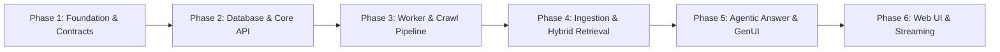

# Company AI — E2E Technical Architecture & Reference Guide

> Status: CORRECTED to live repo (2026-10-01). Source of truth for voice RAG is `VOICE_RAG_IMPLEMENTATION_PLAN.md` (gitignored root). Aspirational items are labeled `PLANNED`, not active.

## 1. Architecture Overview

Use a **TypeScript monorepo + modular monolith + asynchronous background workers**.

```text
                         ┌──────────────────────┐
                         │       Next.js        │
                         │  Chat / Voice / UI   │
                         └──────────┬───────────┘
                                    │
                                HTTP + SSE
                                    │
                                    ▼
                         ┌──────────────────────┐
                         │    Bun + Elysia      │
                         │   Modular Monolith   │
                         └──────────┬───────────┘
                                    │
             ┌──────────────────────┼──────────────────────┐
             │                      │                      │
             ▼                      ▼                      ▼
        Companies              Retrieval              Conversation
        / Ingestion            / Knowledge              / Voice
             │                      │                      │
             └──────────────────────┼──────────────────────┘
                                    │
                                  Redis
                                BullMQ Queue
                                    │
                         ┌──────────┴──────────┐
                         ▼                     ▼
                  Crawl Worker          Processing Worker
                         │                     │
                         ▼                     ▼
                   Playwright /          Extraction & Clean
                   Cheerio               Classification
                   URL discovery         Chunking
                   HTML fetching         Fact Extraction
                                         Vector Embeddings
                         │                     │
                         └──────────┬──────────┘
                                    ▼
                     ┌─────────────────────────────┐
                     │       Knowledge Layer       │
                     │ PostgreSQL (facts/docs) +   │
                     │ Qdrant (vectors) + Redis    │
                     │ (cache/queues) + local      │
                     │ storage/                    │
                     └──────────────┬──────────────┘
                                    │
                            Company Snapshot
                                    │
                                    ▼
                             Hybrid Retrieval
                     (SQL facts + Qdrant top-20 +
                      PG hydration + MMR)
                                    │
                                    ▼
                                LLM Answer
                                    │
                     ┌──────────────┼──────────────┐
                     ▼              ▼              ▼
                   Text     Voice (external)   VisualSpec
                         VoiceKit + LiveKit   PLANNED —
                         web-call + webhook   currently
                         RAG tool             text-only
                                                    │
                                                    ▼
                                              Brand System
                                                    │
                                                    ▼
                                                  GenUI
                                          (registry defined,
                                           not wired to chat)
```

---

## 2. Core Stack Decisions & Justifications

| Layer | Technology | Selection Rationale |
| :--- | :--- | :--- |
| **Monorepo & Package Manager** | **Bun Workspaces + Turborepo** | Native Bun workspaces (`"workspaces"` in `package.json`) + Turborepo task runner & caching. Zero pnpm overhead. |
| **Frontend** | **Next.js (App Router) + React + TS** | Modern server/client component model, SSR, fast client transitions running directly on Bun. |
| **Styling** | **Tailwind CSS + CSS Variables** | Dynamic CSS variable injection for brand tokens (colors, radii, fonts). |
| **UI Components** | **shadcn/ui + Lucide Icons** | Accessible, headless primitives styled with Tailwind; no black-box UI locks. |
| **Backend API** | **Bun.js + Elysia** | Blazing-fast HTTP/SSE throughput, low memory footprint, native TypeScript. |
| **Worker Runtime** | **Bun + BullMQ** | High-performance async queue worker running unified on the Bun runtime. |
| **Database & ORM** | **PostgreSQL + Drizzle ORM** | Typed SQL joins for facts/docs/snapshots/conversations; vectors live in Qdrant, not PG. No `pgvector` column in live schema. |
| **Vector Engine** | **Qdrant v1.12.1 (HNSW)** | Top-20 candidate search + PG hydration + MMR cap 6 (`packages/database/src/retrieval.ts`). Redis `qemb:v1` 1h / `qctx:v1` 5min cache. |
| **Queue / Cache** | **Redis + BullMQ** | Resilient background job management, concurrency throttling, job retry/backoff. Also `rl:*` rate-limit buckets + `voice:room:*` 1h TTL. |
| **Ingestion Engine** | **Playwright + Cheerio + Readability** | Tiered crawler: ultra-fast static fetch (Cheerio) + headless fallback (Playwright). |
| **Object Storage** | **Local `storage/` (no S3 wiring)** | `S3/MinIO/R2` is PLANNED, not active. Logos, assets, raw HTML stay local. |
| **Realtime / Streaming**| **Server-Sent Events (SSE) + LiveKit WebRTC** | SSE (`status/brand/evidence/delta/done/error`) for text; LiveKit `wss://livekit-vyom...` + VoiceKit web-call for voice audio. |
| **Validation** | **Zod (+ Elysia `t`)** | Shared contract validation across API input, worker jobs, LLM function outputs, and GenUI specs. |
| **AI Adapters** | **OpenAI via `packages/shared`** | No `packages/ai` — embeddings + LLM live in `packages/shared/src/embeddings.ts + llm.ts`. Voice STT/LLM/TTS is external VoiceKit (pipeline/cascade), not in-repo. |

> **Architectural Guardrail**: Modular monolith + async workers. Qdrant is the sanctioned vector DB — do not add a second one (no Pinecone, no pgvector dual-write; `QDRANT_DUAL_WRITE` stays `false`).

---

## 3. Monorepo Structure (Bun Workspaces + Turborepo)

```text
company-ai/
│
├── apps/
│   ├── web/                         # Next.js frontend (Chat, UI, GenUI) running on Bun
│   └── api/                         # Elysia API server (Routes, Orchestration) on Bun
│
├── workers/
│   └── worker/                      # BullMQ background workers (Crawl, Ingestion, Embeddings)
│
├── packages/
│   ├── contracts/                   # Shared Zod schemas, API types, GenUI specs
│   ├── database/                    # Drizzle schema + retrieval.ts + cache.ts + rate-limit.ts + qdrant.ts
│   ├── crawler/                     # Cheerio/Playwright crawl logic, robots/sitemap parsing
│   ├── genui/                       # GenUI spec definitions (defined, not wired to chat — PLANNED)
│   ├── queues/                      # BullMQ queue definitions, job types, Redis client
│   └── shared/                      # Logger, env loader, embeddings, LLM, chunker, widget-key helpers
│
│   NOTE: There are no `knowledge/`, `retrieval/`, `ai/`, or `brand/` packages.
│   Retrieval = `packages/database/src/retrieval.ts`; brand extraction lives in the crawler/worker.
├── package.json                     # Root package with native Bun "workspaces" field
├── turbo.json                       # Turborepo task pipeline definition
├── tsconfig.json                    # Shared base TypeScript config
└── .env.example
```

### Root Configuration Pattern

#### Root `package.json`
```json
{
  "name": "company-ai",
  "private": true,
  "workspaces": [
    "apps/*",
    "packages/*",
    "workers/*"
  ],
  "scripts": {
    "dev": "turbo run dev",
    "build": "turbo run build",
    "lint": "turbo run lint",
    "clean": "turbo run clean"
  },
  "devDependencies": {
    "turbo": "^2.4.0",
    "typescript": "^5.7.0"
  }
}
```

#### Turborepo `turbo.json`
```json
{
  "$schema": "https://turbo.build/schema.json",
  "tasks": {
    "build": {
      "dependsOn": ["^build"],
      "outputs": [".next/**", "!.next/cache/**", "dist/**"]
    },
    "dev": {
      "cache": false,
      "persistent": true
    },
    "lint": {}
  }
}
```

### Common Developer CLI Workflows with Bun + Turbo

| Action | Command | What It Does |
| :--- | :--- | :--- |
| **Run all dev servers** | `bun dev` *(or `bun x turbo dev`)* | Concurrently runs Next.js (port 3000), Elysia (port 3001), and Worker with color-coded logs. |
| **Install all dependencies** | `bun install` | Resolves and links all workspace dependencies in sub-seconds. |
| **Add external dep to an app** | `bun --filter api add elysia` | Adds dependency specifically to `apps/api`. |
| **Link internal package** | `bun --filter web add @company-ai/contracts` | Links internal workspace package using Bun workspaces. |
| **Run single app dev** | `bun x turbo --filter web dev` | Starts only the Next.js frontend. |
| **Build all packages** | `bun run build` | Builds packages in topological order with Turbo intelligent caching. |

### Process Topologies
Deploy and run three distinct process targets:
1. `apps/web` (Next.js server via Bun)
2. `apps/api` (Elysia API orchestrator via Bun)
3. `workers/worker` (BullMQ async processor via Bun)

The packages under `packages/*` are **logical boundaries**, shared directly across apps and workers without separate network hops.

---

## 4. Frontend Architecture (`apps/web`)

Live routes: `/?company=<id>` main chat, `/embed/[key]` widget panel, `/ingest` studio.

```text
apps/web/
│
├── app/
│   ├── layout.tsx
│   ├── page.tsx                     # Main chat (/?company= deep-link, PromptInput dock, VoiceSession companyId)
│   ├── embed/[key]/page.tsx         # Compact widget panel (widgetKey + apiBase override, mic gated on Ready)
│   └── ingest/page.tsx              # IngestionStudio entry
│
├── components/
│   ├── ai-elements/prompt-input.tsx # PromptInput dock (mic slot in footer)
│   ├── voice/voice-session.tsx      # Token→LiveKit join→silent lk.transcription buffer→finalize
│   ├── voice/voice-chat-button.tsx  # Mic/X toggle + AmplitudeBars + error chip
│   ├── chat-message.tsx             # Text bubbles (voice lines appended as plain text, no evidence)
│   ├── evidence-drawer.tsx          # Text-chat citations drawer (voice v1 has none by design)
│   ├── ingestion/ingestion-studio.tsx
│   └── sidebar/app-sidebar.tsx      # Company switcher (switch discards in-flight voice lines)
│
├── hooks/
│   └── use-company-chat.ts          # sendMessage SSE state machine + appendVoiceTranscript (local-only)
│
├── lib/
│   ├── api-client.ts                # chat.stream + embed.streamChat + embed.getConfig, SSE parser
│   └── voice-client.ts              # fetchVoiceToken POST /api/voice/token (VOICEKIT key never in browser)
│
└── public/embed.js                  # Loader orb + lazy iframe, allow="microphone; autoplay"
```

### Strict Frontend Responsibilities
* **Owns**: UI rendering, local client state, SSE event consumption, queue-based audio playback, brand token CSS injection, verified component mapping.
* **Prohibits**: Executing arbitrary AI-generated JSX, HTML `dangerouslySetInnerHTML`, or unvalidated dynamic scripts.

---

## 5. Generative UI (GenUI) Architecture — PLANNED, NOT ACTIVE

> Chat is text-only today: `chat.ts` + `embed.ts` persist `visualSpec: null` and stream no visual events. The spec below is the future contract; `packages/genui` defines it but nothing renders it.

The LLM does **not** write raw UI code or HTML. The LLM generates a strictly validated **VisualSpec JSON**.

```text
      LLM Output (JSON)
              │
              ▼
    Zod Validation (packages/contracts)
              │
              ▼
    GenUI Component Registry
              │
              ▼
   Brand System CSS Token Wrap
              │
              ▼
     Rendered React Component
```

### VisualSpec Definition
```ts
export type VisualSpec =
  | {
      type: "stats";
      props: {
        title: string;
        items: { label: string; value: string; change?: string }[];
      };
    }
  | {
      type: "pricing";
      props: {
        plans: {
          name: string;
          price: string;
          period?: string;
          features: string[];
          highlighted?: boolean;
        }[];
      };
    }
  | {
      type: "timeline";
      props: {
        events: { date: string; title: string; description: string }[];
      };
    }
  | {
      type: "comparison";
      props: {
        headers: string[];
        rows: { feature: string; values: (string | boolean)[] }[];
      };
    }
  | {
      type: "products";
      props: {
        products: { name: string; description: string; tag?: string; link?: string }[];
      };
    };
```

### Component Registry Pattern
```tsx
// apps/web/components/generative/registry.tsx
export const componentRegistry: Record<string, React.FC<any>> = {
  hero: Hero,
  stats: Stats,
  pricing: Pricing,
  products: ProductGrid,
  timeline: Timeline,
  comparison: Comparison,
  people: People,
  quote: Quote,
};

export function GenUIRenderer({ spec, brand }: { spec: VisualSpec; brand: BrandTokens }) {
  const Component = componentRegistry[spec.type];
  if (!Component) return null;

  return (
    <div className="genui-container" style={brandToCSSVariables(brand)}>
      <Component {...spec.props} />
    </div>
  );
}
```

* **The AI determines**: *What* information structure to present.
* **The Application determines**: *How* it is safely rendered and visually branded.

---

## 6. Backend API Architecture (`apps/api`)

Live: flat Elysia routes + `server.ts` assembly (no `modules/` / `infrastructure/` / `app.ts`).

```text
apps/api/src/
│
├── routes/
│   ├── chat.ts                      # POST /api/companies/:id/chat (SSE, grounded text)
│   ├── companies.ts                 # Company CRUD + snapshot lifecycle
│   ├── crawler.ts / companies crawl # Ingestion triggers, job status dispatch
│   ├── embed.ts                     # Widget keys + GET /:key/config + POST /:key/chat (SSE)
│   ├── voice.ts                     # POST /api/voice/token (READY-gate + rate-limit + VoiceKit mint, injects metadata.company.id)
│   └── voice-tool.ts                # POST /api/voice/tool/query (VoiceKit in-call RAG webhook)
│
└── server.ts                        # cors + swagger (/swagger) + health (GET /health) + route assembly
```

Each route owns its validation (`t.Object`), READY-gate (`companySnapshots ORDER BY version DESC`), and rate limits (`checkEmbedRateLimit`, scopes `embed` / `voice` / `voice-tool`).

---

## 7. Company Lifecycle & Snapshot Versioning

The core domain entity is the **Company**, versioned immutably via **CompanySnapshot**.

```text
Company
│
├── Brand (Latest tokens, logo, typography)
├── Crawls (Historical crawl runs)
│   ├── Pages Discovered
│   └── Crawl Errors/Events
├── Snapshots (Immutable knowledge versions)
│   ├── Snapshot v1 (Initial ingest)
│   │   ├── Documents
│   │   ├── Facts
│   │   └── Vector Chunks
│   └── Snapshot v2 (Refreshed ingest)
└── Conversations (User threads citing specific snapshots)
```

### Benefits of Immutable Snapshots
1. **Reproducibility**: Answers link back to the exact snapshot and document revision used.
2. **Atomic Ingestion**: New crawls publish a complete, verified snapshot only after all embeddings and facts are indexed (`status: READY`).
3. **Differential Updates**: Compare `Snapshot v2` against `v1` to identify deleted pages, pricing adjustments, or added products.

---

## 8. Tiered Ingestion & Crawler Pipeline

```text
POST /companies  { url: "https://example.com" }
       │
       ▼
1. Normalize URL & Verify Security (Prevent SSRF / Private IPs)
       │
       ▼
2. Create Company & Pending Snapshot record
       │
       ▼
3. Dispatch BullMQ Job { companyId, snapshotId, url }
       │
       ▼
Return HTTP 202 Accepted { companyId, jobId, status: "queued" }
```

### Worker Pipeline Workflow
```text
BullMQ Ingestion Worker
       │
       ▼
[Tier 1 Discovery]
Sitemap.xml, robots.txt, canonical links
       │
       ▼
[Tiered Fetching]
  ├─ Fast Path: Cheerio HTTP Fetch (Static HTML, fast, lightweight)
  └─ Dynamic Fallback: Playwright Headless (When client-side JS / hydration detected)
       │
       ▼
[Content Extraction & Cleaning]
Mozilla Readability + Cheerio stripping (nav, footers, cookie banners, scripts)
       │
       ▼
[Brand Intelligence Extraction]
Favicon, logos, primary/secondary colors, CSS font rules, meta themes
       │
       ▼
[Document Processing]
  ├─ Structured Fact Extraction (LLM identifies key value pairs: pricing, founders, address)
  └─ Semantic Chunking (500–1000 tokens with overlap)
       │
       ▼
[Embedding Generation & Indexing]
Compute vector embeddings (e.g., text-embedding-3-small)
       │
       ▼
[Transactional Commit]
Save Pages, Documents, Chunks, Embeddings, Facts, and Brand to PostgreSQL
       │
       ▼
Publish Snapshot Status: "READY"
```

### Crawler Safeguards
* **SSRF Protection**: Reject private IP ranges (`127.0.0.1`, `10.0.0.0/8`, `192.168.0.0/16`, AWS metadata `169.254.169.254`).
* **Hard Limits**: `maxPages` (default 50), `maxDepth` (default 3), `maxPageSizeBytes` (5MB), `crawlTimeoutMs` (5 mins).
* **Concurrency**: Restrict Playwright browser pools to 2–4 concurrent instances per worker to protect memory.

---

## 9. Knowledge Layer & Database Models (Drizzle ORM)

PostgreSQL (facts/docs/snapshots) + Qdrant (vectors) + Redis (cache/queues) is the live source of truth. There is no `pgvector` column and no `pages` table.

```text
PostgreSQL (packages/database/src/schema.ts)
├── companies
├── company_snapshots
├── brands
├── documents
├── chunks (id, document_id, content, chunk_index — NO embedding column)
├── facts
├── conversations
├── messages
├── crawl_jobs
└── widget_keys

Qdrant (QDRANT_URL, collection per env)
└── chunk points {id = chunk UUID, vector 1536-dim, payload {company_id, snapshot_id, title, url}}

Redis
├── qemb:v1:{queryHash} (1h) / qctx:v1:{company}:{snapshot}:{queryHash}:{limit} (5min)
├── rl:{embed|voice|voice-tool}:* (rate limits)
└── voice:room:<roomName> (1h, room→company for voice)

Local storage/
└── storage/ (no S3 wiring)
```

### Core Schema Definition (`packages/database/src/schema.ts`)
```ts
import { pgTable, uuid, text, timestamp, jsonb, integer, index, boolean } from "drizzle-orm/pg-core";

export const companies = pgTable("companies", {
  id: uuid("id").defaultRandom().primaryKey(),
  domain: text("domain").notNull().unique(),
  name: text("name").notNull(),
  url: text("url").notNull(),
  createdAt: timestamp("created_at").defaultNow().notNull(),
});

export const companySnapshots = pgTable("company_snapshots", {
  id: uuid("id").defaultRandom().primaryKey(),
  companyId: uuid("company_id").references(() => companies.id).notNull(),
  version: integer("version").notNull(),
  status: text("status").notNull(), // 'QUEUED' | 'CRAWLING' | 'PROCESSING' | 'READY' | 'FAILED'
  pageCount: integer("page_count").default(0),
  createdAt: timestamp("created_at").defaultNow().notNull(),
});

export const brands = pgTable("brands", {
  id: uuid("id").defaultRandom().primaryKey(),
  companyId: uuid("company_id").references(() => companies.id).notNull(),
  logoUrl: text("logo_url"),
  tokens: jsonb("tokens").notNull(), // BrandTokens structure
  createdAt: timestamp("created_at").defaultNow().notNull(),
});

export const documents = pgTable("documents", {
  id: uuid("id").defaultRandom().primaryKey(),
  snapshotId: uuid("snapshot_id").references(() => companySnapshots.id).notNull(),
  url: text("url").notNull(),
  title: text("title").notNull(),
  category: text("category").notNull(), // 'about' | 'pricing' | 'product' | 'general'
  content: text("content").notNull(),
  contentHash: text("content_hash").notNull(),
  wordCount: integer("word_count").default(0).notNull(),
  headings: jsonb("headings").default([]).notNull(),
  createdAt: timestamp("created_at").defaultNow().notNull(),
});

export const chunks = pgTable("chunks", {
  id: uuid("id").defaultRandom().primaryKey(),
  documentId: uuid("document_id").references(() => documents.id).notNull(),
  content: text("content").notNull(),
  chunkIndex: integer("chunk_index").notNull(),
  // NOTE: no embedding column — vectors live in Qdrant keyed by chunk id.
});

export const facts = pgTable("facts", {
  id: uuid("id").defaultRandom().primaryKey(),
  snapshotId: uuid("snapshot_id").references(() => companySnapshots.id).notNull(),
  documentId: uuid("document_id").references(() => documents.id),
  subject: text("subject").notNull(),
  predicate: text("predicate").notNull(),
  value: text("value").notNull(),
  confidence: integer("confidence").default(100),
});
```

---

## 10. Hybrid Retrieval Engine (live: `packages/database/src/retrieval.ts`)

Never dump the whole site into the LLM window. Live pipeline: deterministic SQL facts + Qdrant top-20 + PG hydration + local MMR (lambda 0.7, cap 6) with Redis caches. No Keyword/FTS pillar, no RRF.

```text
                      User Question
                            │
                            ▼
              Company + latest READY snapshot
                            │
         ┌──────────────────┼──────────────────┐
         ▼                  ▼                  ▼
     1. SQL Facts      2. Qdrant top-20    3. Redis caches
    Exact attribute   Semantic vectors     qemb 1h (query vec)
    per snapshot      filtered by          qctx 5min (compiled
                      company+snapshot     context, cut on READY)
         │                  │                  │
         └──────────────────┼──────────────────┘
                            ▼
                     PG hydration by
                     chunk UUIDs + MMR
                            │
                            ▼
                       EvidenceSet
               (facts + chunks, score 0..1)
                            │
                            ▼
                  compiledPromptContext
               (text chat) / voice-safe
               COMPANY/FACTS/EXCERPTS ≤6000
               chars (voice-tool.ts)
```

### The EvidenceSet Contract
```ts
export type Evidence = {
  sourceId: string;
  url: string;
  pageTitle: string;
  snippet: string;
  type: "fact" | "chunk";
  score: number;
};
```

---

## 11. Answer Contracts — text SSE (active) vs unified multimodal (PLANNED)

Live text contract: grounded text + evidence, `visualSpec: null`. Voice answers come from the external VoiceKit agent via the RAG webhook, not from this contract's `speech` field.

```ts
export type TextAnswer = {
  text: string;                  // Grounded conversational response
  evidence: Evidence[];          // Verified citations used
  visualSpec: null;              // Text-only today; VisualSpec is PLANNED
};

// Voice RAG webhook (apps/api/src/routes/voice-tool.ts)
export type VoiceToolResponse = {
  result: string;                // Voice-safe COMPANY/FACTS/EXCERPTS ≤6000 chars, plain speech
  evidence_count: number;
  snapshot_id: string;
};
```

### Live streaming flows
```text
TEXT:
Question → retrieveCompanyContext → systemPrompt+history → SSE status → brand → evidence → delta* → done (+PG persist conversations/messages)

VOICE:
mic → POST /api/voice/token (READY-gate + voice:* limit + mint metadata.company.id) → LiveKit join → STT text → LLM calls query_company_knowledge {query, company_id} → POST /api/voice/tool/query (401/404/409/429 gates + retrieval + voice-safe result) → grounded spoken answer (<60w) → TTS
```

---

## 12. Brand Intelligence System

During the crawl phase, the worker extracts stylistic indicators to create a `BrandTokens` profile:

```ts
export type BrandTokens = {
  colors: {
    primary: string;       // Extracted main brand color (Hex/HSL)
    secondary?: string;     // Accent color
    background: string;    // Light or dark base background
    foreground: string;    // Contrasting text color
  };
  typography: {
    headingFont?: string;  // Detected web font or fallback family
    bodyFont?: string;
  };
  radius: string;          // Extracted border-radius style ('0rem' | '0.375rem' | '0.75rem' | '9999px')
  style: "corporate" | "playful" | "minimal" | "technical";
};
```

The frontend uses these tokens to dynamically inject CSS variables into the GenUI wrapper, making rendered components (Pricing cards, Hero, Stats) look natively branded for each company.

---

## 13. Queue Architecture (`packages/queues`)

Use **Redis + BullMQ** for ingestion; Redis doubles as cache + rate limits + voice room map.

### Live Redis uses
1. Ingest queues (crawl/discovery/processing — see `workers/worker`).
2. `qemb:v1` / `qctx:v1` retrieval caches.
3. `rl:{embed|voice|voice-tool}:*` rate-limit buckets (`checkEmbedRateLimit`).
4. `voice:room:*` 1h TTL (voice mint room→company).

> `voice-queue` TTS rendering from the old plan is unused — voice audio is external VoiceKit/LiveKit, not BullMQ.

---

## 14. Server-Sent Events (SSE) Contract (live)

Text endpoints: `POST /api/companies/:id/chat` and `POST /api/embed/:key/chat`.

### Live event stream
```text
event: status
data: { "stage": "retrieving" | "synthesizing", "message": "..." }

event: brand
data: { "logoUrl": "...", "tokens": {...} }

event: evidence
data: [{ "sourceId": "...", "url": "...", "pageTitle": "...", "snippet": "...", "type": "fact"|"chunk", "score": 0..1 }]

event: delta
data: { "text": "Acme Corp provides..." }

event: done
data: { "conversationId": "uuid", "messageId": "uuid", "evidenceCount": 3, "hasVisual": false }

event: error
data: { "message": "..." }
```

Voice has no SSE — mic goes over LiveKit WebRTC; transcripts buffer `lk.transcription` silently and append as plain-text bubbles post-call (no evidence by design v1).

---

## 15. Live API Surface (`apps/api`, see `/swagger`)

```text
# Health / docs
GET    /health                       # {status, service, timestamp}
GET    /swagger                      # Elysia swagger UI

# Company ingestion (routes/companies.ts + crawler.ts)
POST   /api/companies                # Submit URL, trigger background crawl
GET    /api/companies                # List indexed companies
GET    /api/companies/:id            # Company summary + latest snapshot

# Grounded text chat (SSE: status/brand/evidence/delta/done/error)
POST   /api/companies/:id/chat       # {message, conversationId?}
GET    /api/companies/:id/conversations
GET    /api/conversations/:id/messages

# Embed widget (opaque agw_ keys, READY-gate + 429 + retry-after)
POST   /api/embed/keys               # Issue/reuse widget key
GET    /api/embed/keys?companyId=    # List key prefixes
POST   /api/embed/keys/:keyId/revoke # Revoke (later 410)
GET    /api/embed/:key/config        # Public config + ready flag
POST   /api/embed/:key/chat          # Anonymous SSE chat

# Voice (VoiceKit + LiveKit wss://livekit-vyom...)
POST   /api/voice/token              # {companyId|widgetKey, metadata?} → {token, roomName, livekitUrl}
POST   /api/voice/tool/query         # VoiceKit tool webhook {company_id uuid, query 1-2000} → {result, evidence_count, snapshot_id}
```

---

## 16. Phased Implementation Roadmap


```mermaid
flowchart LR
    P1[Phase 1: Foundation & Contracts] --> P2[Phase 2: Database & Core API]
    P2 --> P3[Phase 3: Worker & Crawl Pipeline]
    P3 --> P4[Phase 4: Ingestion & Hybrid Retrieval]
    P4 --> P5[Phase 5: Agentic Answer & GenUI]
    P5 --> P6[Phase 6: Web UI & Streaming]
```

### Phase 1: Workspace & Shared Contracts
* Set up root `package.json` with native Bun workspaces, `turbo.json`, and base `tsconfig.json`.
* Initialize `packages/contracts` with shared Zod schemas for `Company`, `Crawl`, `BrandTokens`, `VisualSpec`, and `Answer`.
* Initialize `packages/shared` with logger, environment validator, and constants.

### Phase 2: Database Layer & Core API Skeleton
* Initialize `packages/database` with PostgreSQL connection pool and Drizzle ORM schema (`pgvector` enabled).
* Initialize `apps/api` with Bun + Elysia and basic health check & modular route scaffolding.
* Run initial database migrations.

### Phase 3: Ingestion Workers & Crawler Pipeline
* Set up Redis + BullMQ in `packages/queues`.
* Implement crawler in `packages/crawler`:
  * Fast Cheerio fetcher + Playwright dynamic fallback.
  * Security guards (SSRF check, depth/page limits).
  * Mozilla Readability document extractor.
  * Brand token extractor (colors, logo, typography).
* Wire up `workers/worker` to process `crawl-queue` and create snapshot records.

### Phase 4: Knowledge Processing & Hybrid Retrieval — DONE (as-built)
* Chunking + fact extraction run in worker/crawler pipeline.
* Embeddings via `packages/shared`; Qdrant top-20 + PG hydration + MMR in `packages/database/src/retrieval.ts` (not `packages/retrieval`, no pgvector/FTS/RRF).
* Redis `qemb` 1h / `qctx` 5min caches with READY invalidation.

### Phase 5: Answer Engine & Generative UI Core — TEXT DONE, GENUI DEFERRED
* LLM streaming via `packages/shared` + `chat.ts` / `embed.ts` SSE (`status/brand/evidence/delta/done/error`); `visualSpec: null` text-only.
* `packages/genui` + `packages/contracts` VisualSpec stay defined but unwired (PLANNED).

### Phase 6: Next.js Frontend & Streaming — DONE (as-built)
* `/?company=` main chat + `/embed/[key]/` widget + `/ingest` studio with Tailwind + shadcn + Phosphor icons.
* `use-company-chat.ts` SSE state machine + `voice-client.ts` token proxy + `voice-session.tsx` LiveKit join + silent transcription buffer.
* Brand styling via CSS vars (`--brand-primary`).

### Phase 7: Voice RAG via VoiceKit webhook — DONE (see VOICE_RAG_IMPLEMENTATION_PLAN.md)
* Phase 0 echo probe (during-call `{query, company_id}` + end-call transcript split).
* Phase 1 `POST /api/voice/tool/query` (Bearer `VOICE_TOOL_SECRET`, 401/404/409/429, `retrieveCompanyContext` chunkLimit 6, voice-safe ≤6000 chars).
* Phase 2 mint `metadata.company.id` + `voice:room:*` 1h TTL + `{{company.id}}` prompt (single shared assistant, per-call isolation).
* Dashboard: `query_company_knowledge` webhook (timeout 25) attached + MUST-call prompt.
